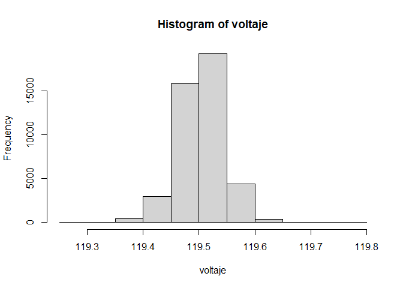
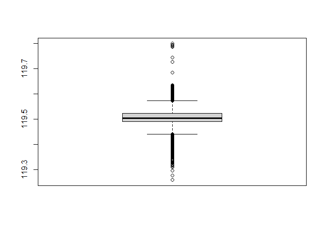
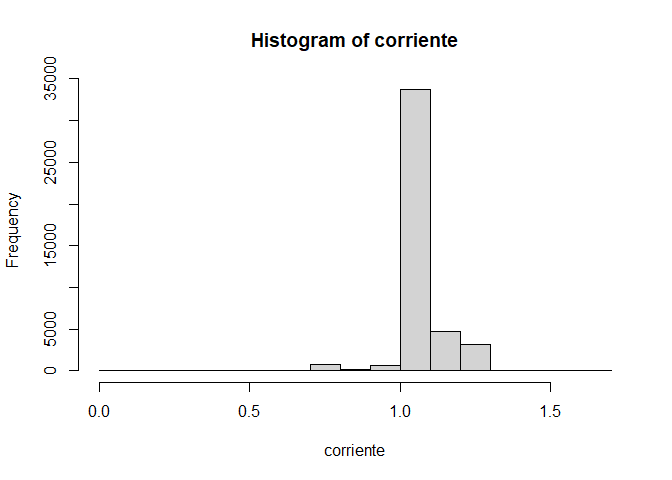
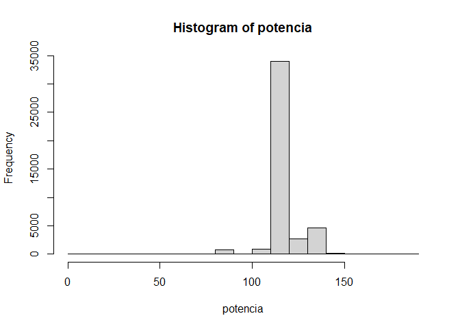
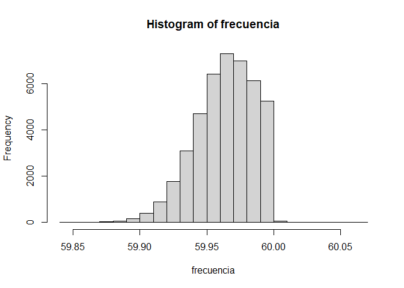
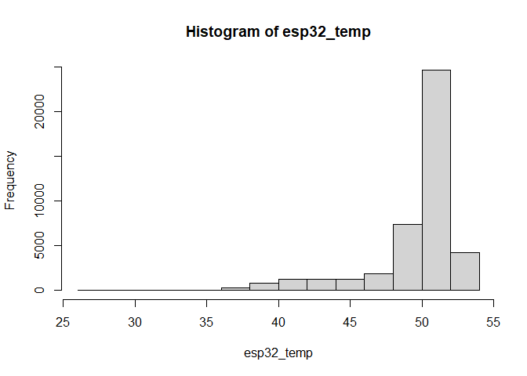
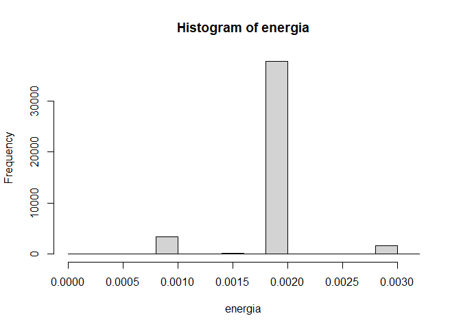
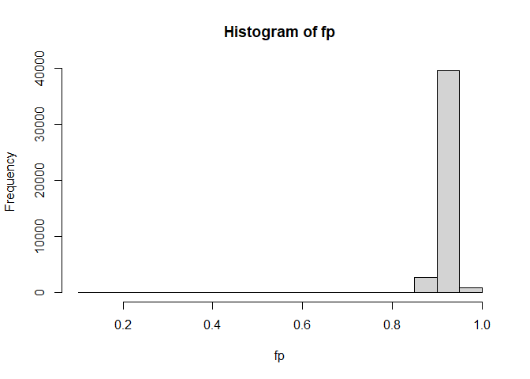
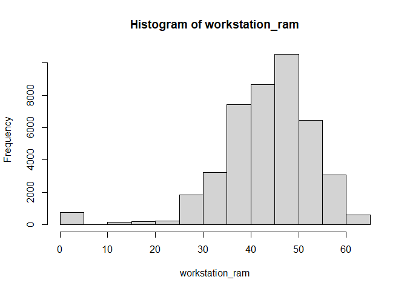

##Descripcion del Dataset El archivo
junio2022_minuto_sin_interpolación.csv y el archivo
junio2022_minuto_con_interpolación.csv contienen datos medidos
clasificados en: *Variables Energeticas:* - **Voltaje:** -
**Corriente:** - **Potencia:** - **Frecuencia:** - **Energia:** -
**Factor de Potencia (fp):** - **Temperatura (esp32_temp):**

*Variables de Rendimiento :* - **CPU (workstation_cpu):** - **Potencia
CPU(workstation_cpu_power):** - **Temperatura
CPU(workstation_cpu_temp:** - **GPU:** - **Potencia GPU:** -
**Temperatura GPU:** - **RAM (workstation_ram):** - **Potencia de RAM
(workstation_ram_power):**

### Carga de los dataset

``` r
datos_con_interpolacion <- read.csv("junio2022_minuto_sin_interpolación.csv")
datos_con_interpolacion <- read.csv("junio2022_minuto_con_interpolación.csv")
head(datos_con_interpolacion)
```

    ##                 mac weekday         fecha_esp32  voltaje corriente potencia
    ## 1 3C:61:05:12:96:30       3 2022-06-01 00:01:00 119.4133  1.141783 124.9933
    ## 2 3C:61:05:12:96:30       3 2022-06-01 00:02:00 119.4100  1.080950 117.0683
    ## 3 3C:61:05:12:96:30       3 2022-06-01 00:03:00 119.4000  1.082900 117.4250
    ## 4 3C:61:05:12:96:30       3 2022-06-01 00:04:00 119.4067  1.068617 115.4533
    ## 5 3C:61:05:12:96:30       3 2022-06-01 00:05:00 119.4233  1.070567 115.7667
    ## 6 3C:61:05:12:96:30       3 2022-06-01 00:06:00 119.3967  1.185650 130.1133
    ##   frecuencia energia        fp esp32_temp workstation_cpu workstation_cpu_power
    ## 1   59.92833   0.000 0.9158333   49.75923        14.33467              41.89000
    ## 2   59.98833   0.002 0.9071667   49.79627        11.76633              41.19183
    ## 3   60.00000   0.002 0.9073333   51.54627        11.34200              41.89000
    ## 4   59.99833   0.001 0.9043333   49.78701        11.22467              41.89000
    ## 5   59.95500   0.002 0.9055000   50.65738        11.42617              41.89000
    ## 6   59.97833   0.003 0.9181667   48.02775        16.55817              41.89000
    ##   workstation_cpu_temp workstation_gpu workstation_gpu_power
    ## 1             34.53333      0.01666667              35.00000
    ## 2             30.76667      0.00000000              34.41667
    ## 3             30.51667      0.00000000              35.00000
    ## 4             30.00000      0.00000000              35.00000
    ## 5             30.10000      0.00000000              35.00000
    ## 6             39.25000      0.00000000              35.00000
    ##   workstation_gpu_temp workstation_ram workstation_ram_power
    ## 1             14.54300        48.33317              8.626667
    ## 2             14.28000        47.18517              6.558000
    ## 3             14.54233        48.13800              6.598000
    ## 4             14.54950        47.94800              6.428833
    ## 5             14.56000        47.94333              6.423167
    ## 6             14.52117        47.90600             11.830833

``` r
summary(datos_con_interpolacion)
```

    ##      mac               weekday      fecha_esp32           voltaje     
    ##  Length:43200       Min.   :1.000   Length:43200       Min.   :119.3  
    ##  Class :character   1st Qu.:2.000   Class :character   1st Qu.:119.5  
    ##  Mode  :character   Median :4.000   Mode  :character   Median :119.5  
    ##                     Mean   :3.967                      Mean   :119.5  
    ##                     3rd Qu.:6.000                      3rd Qu.:119.5  
    ##                     Max.   :7.000                      Max.   :119.8  
    ##    corriente         potencia        frecuencia       energia        
    ##  Min.   :0.0958   Min.   :  1.25   Min.   :59.84   Min.   :0.000000  
    ##  1st Qu.:1.0549   1st Qu.:113.92   1st Qu.:59.95   1st Qu.:0.002000  
    ##  Median :1.0780   Median :116.80   Median :59.97   Median :0.002000  
    ##  Mean   :1.0818   Mean   :117.48   Mean   :59.96   Mean   :0.001959  
    ##  3rd Qu.:1.0909   3rd Qu.:118.44   3rd Qu.:59.98   3rd Qu.:0.002000  
    ##  Max.   :1.6260   Max.   :182.79   Max.   :60.07   Max.   :0.003087  
    ##        fp           esp32_temp    workstation_cpu  workstation_cpu_power
    ##  Min.   :0.1017   Min.   :26.11   Min.   : 0.000   Min.   : 0.00        
    ##  1st Qu.:0.9038   1st Qu.:49.37   1st Qu.: 7.616   1st Qu.:40.89        
    ##  Median :0.9068   Median :50.65   Median :10.651   Median :41.56        
    ##  Mean   :0.9084   Mean   :49.65   Mean   :10.687   Mean   :41.05        
    ##  3rd Qu.:0.9097   3rd Qu.:51.53   3rd Qu.:12.670   3rd Qu.:42.92        
    ##  Max.   :0.9705   Max.   :53.33   Max.   :69.023   Max.   :54.87        
    ##  workstation_cpu_temp workstation_gpu    workstation_gpu_power
    ##  Min.   : 0.00        Min.   : 0.00000   Min.   : 0.00        
    ##  1st Qu.:29.10        1st Qu.: 0.00000   1st Qu.:35.00        
    ##  Median :31.02        Median : 0.00000   Median :35.07        
    ##  Mean   :31.48        Mean   : 0.23611   Mean   :34.78        
    ##  3rd Qu.:32.68        3rd Qu.: 0.01667   3rd Qu.:36.00        
    ##  Max.   :77.08        Max.   :33.25000   Max.   :40.13        
    ##  workstation_gpu_temp workstation_ram workstation_ram_power
    ##  Min.   : 0.00        Min.   : 0.00   Min.   : 0.000       
    ##  1st Qu.:14.40        1st Qu.:38.26   1st Qu.: 6.452       
    ##  Median :14.53        Median :44.50   Median : 7.439       
    ##  Mean   :14.24        Mean   :43.28   Mean   : 8.111       
    ##  3rd Qu.:14.63        3rd Qu.:49.66   3rd Qu.: 9.427       
    ##  Max.   :39.85        Max.   :62.50   Max.   :23.360

### Voltaje

``` r
voltaje<-datos_con_interpolacion['voltaje']
voltaje<- unlist(voltaje)
hist(voltaje)
```



``` r
boxplot(voltaje)
```


###corriente

``` r
corriente<-datos_con_interpolacion['corriente']
corriente<- unlist(corriente)
hist(corriente)
```


###potencia

``` r
potencia<-datos_con_interpolacion['potencia']
potencia<- unlist(potencia)
hist(potencia)
```


###frecuencia

``` r
frecuencia<-datos_con_interpolacion['frecuencia']
frecuencia<- unlist(frecuencia)
hist(frecuencia)
```


###energia

``` r
energia<-datos_con_interpolacion['energia']
energia<- unlist(energia)
hist(energia)
```

 ###fp

``` r
fp<-datos_con_interpolacion['fp']
fp<- unlist(fp)
hist(fp)
```


###esp32_temp

``` r
esp32_temp<-datos_con_interpolacion['esp32_temp']
esp32_temp<- unlist(esp32_temp)
hist(esp32_temp)
```


###workstation_cpu

``` r
workstation_cpu<-datos_con_interpolacion['workstation_cpu']
workstation_cpu<- unlist(workstation_cpu)
hist(workstation_cpu)
```


###workstation_cpu_power

``` r
workstation_cpu_power<-datos_con_interpolacion['workstation_cpu_power']
workstation_cpu_power<- unlist(workstation_cpu_power)
hist(workstation_cpu_power)
```


###workstation_cpu_temp

``` r
workstation_cpu_temp<-datos_con_interpolacion['workstation_cpu_temp']
workstation_cpu_temp<- unlist(workstation_cpu_temp)
hist(workstation_cpu_temp)
```


###workstation_gpu

``` r
workstation_gpu<-datos_con_interpolacion['workstation_gpu']
workstation_gpu<- unlist(workstation_gpu)
hist(workstation_gpu)
```


###workstation_gpu_power

``` r
workstation_gpu_power<-datos_con_interpolacion['workstation_gpu_power']
workstation_gpu_power<- unlist(workstation_gpu_power)
hist(workstation_gpu_power)
```


###workstation_gpu_temp

``` r
workstation_gpu_temp<-datos_con_interpolacion['workstation_gpu_temp']
workstation_gpu_temp<- unlist(workstation_gpu_temp)
hist(workstation_gpu_temp)
```


###workstation_ram

``` r
workstation_ram<-datos_con_interpolacion['workstation_ram']
workstation_ram<- unlist(workstation_ram)
hist(workstation_ram)
```


###workstation_ram_power

``` r
workstation_ram_power<-datos_con_interpolacion['workstation_ram_power']
workstation_ram_power<- unlist(workstation_ram_power)
hist(workstation_ram_power)
```



### Prueba de bondad de ajuste

### Prueba de significancia
