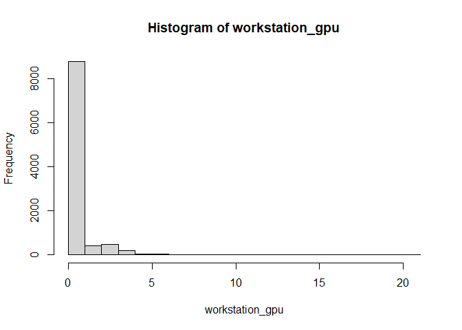
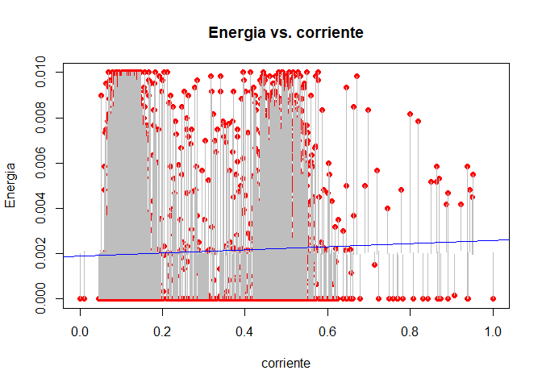

### Descripcion del proyecto 

El propósito de este proyecto es aplicar conocimientos de Estadística
Descriptiva e Inferencial en un proyecto titulado ‘Preprocesamiento,
extracción de características y predicción de consumo de energía en
tiempo real basada en Inteligencia Artificial en el borde o en la
niebla’. Este trabajo implica la medición de diversas variables
energéticas y de consumo en dispositivos Workstation, cuyas
características son similares a las de dispositivos en un datacenter. El
objetivo es predecir su consumo energético. Se han recopilado mediciones
de estas variables a lo largo de los años. Un desafío identificado es la
presencia de datos incompletos, los cuales se propone completar mediante
técnicas de interpolación. Una vez resuelto este problema, se utilizarán
métodos como la regresión lineal múltiple para predecir el consumo
energético.

### Descripcion del Dataset 

Los archivos ‘junio2022_minuto_sin_interpolación.csv’ y
‘junio2022_minuto_con_interpolación.csv’ contienen datos de mediciones
clasificados en dos categorías: *variables energéticas* y *variables de
rendimiento*. El archivo ‘junio2022_minuto_sin_interpolación.csv’
presenta la data original, con datos faltantes (546). Por otro lado, el
archivo ‘junio2022_minuto_con_interpolación.csv’ contiene los mismos
datos, pero después de haber aplicado la técnica de interpolación para
completar los valores faltantes. :

*Variables Energéticas:* <br> - **Voltaje**<br> - **Corriente**<br> -
**Potencia**<br> - **Frecuencia**<br> - **Energía**<br> - **Factor de
Potencia (fp)**<br> - **Temperatura (esp32_temp)**<br>

*Variables de Rendimiento:* <br> - **CPU (workstation_cpu)**<br> -
**Potencia CPU (workstation_cpu_power)**<br> - **Temperatura CPU
(workstation_cpu_temp)**<br> - **GPU**<br> - **Potencia GPU**<br> -
**Temperatura GPU**<br> - **RAM (workstation_ram)**<br> - **Potencia de
RAM (workstation_ram_power)**<br>

### Datos sin interpolacion

``` r
#datos_sin_interpolacion <- read.csv("junio2022_07_minuto_sin_interpolacion.csv")
datos_sin_interpolacion <- read.csv("julio2022_minuto_sin_interpolacion.csv")
head(datos_sin_interpolacion)
```

    ##                 mac weekday         fecha_esp32  voltaje corriente potencia
    ## 1 3C:61:05:12:96:30       6 2022-07-02 00:00:00 119.4100  1.077083 117.5867
    ## 2 3C:61:05:12:96:30       6 2022-07-02 00:01:00 119.4100  1.085217 118.6383
    ## 3 3C:61:05:12:96:30       6 2022-07-02 00:02:00 119.4000  1.087017 118.6633
    ## 4 3C:61:05:12:96:30       6 2022-07-02 00:03:00 119.4033  1.082417 118.1600
    ## 5 3C:61:05:12:96:30       6 2022-07-02 00:04:00 119.4067  1.085350 118.5233
    ## 6 3C:61:05:12:96:30       6 2022-07-02 00:05:00 119.4067  1.083950 118.3850
    ##   frecuencia energia        fp esp32_temp workstation_cpu workstation_cpu_power
    ## 1   59.95833   0.002 0.9140000   49.36108       10.376833                  43.1
    ## 2   59.98333   0.002 0.9151667   48.92590       10.375667                  43.1
    ## 3   59.98000   0.002 0.9143333   48.04627        9.723500                  43.1
    ## 4   59.98500   0.002 0.9145000   48.05553        9.487167                  43.1
    ## 5   59.97333   0.002 0.9141667   50.24997        9.707333                  43.1
    ## 6   59.96167   0.002 0.9146667   50.69442       10.461500                  43.1
    ##   workstation_cpu_temp workstation_gpu workstation_gpu_power
    ## 1             33.35000               0              36.00000
    ## 2             33.43333               0              36.00000
    ## 3             32.56667               0              36.00000
    ## 4             32.31667               0              36.00000
    ## 5             32.53333               0              35.96667
    ## 6             33.60000               0              36.00000
    ##   workstation_gpu_temp workstation_ram workstation_ram_power
    ## 1             14.67700        47.17817              9.009000
    ## 2             14.71567        47.19500              9.744833
    ## 3             14.76150        47.17983              8.961667
    ## 4             14.80250        47.24117              8.904667
    ## 5             14.75950        47.24100              9.256000
    ## 6             14.59967        47.24117              9.928167

``` r
summary(datos_sin_interpolacion)
```

    ##      mac               weekday  fecha_esp32           voltaje     
    ##  Length:10080       Min.   :1   Length:10080       Min.   :119.3  
    ##  Class :character   1st Qu.:2   Class :character   1st Qu.:119.4  
    ##  Mode  :character   Median :4   Mode  :character   Median :119.4  
    ##                     Mean   :4                      Mean   :119.4  
    ##                     3rd Qu.:6                      3rd Qu.:119.4  
    ##                     Max.   :7                      Max.   :119.6  
    ##                                                    NA's   :599    
    ##    corriente        potencia       frecuencia       energia     
    ##  Min.   :1.052   Min.   :113.3   Min.   :59.84   Min.   :0.000  
    ##  1st Qu.:1.085   1st Qu.:118.5   1st Qu.:59.95   1st Qu.:0.000  
    ##  Median :1.089   Median :118.9   Median :59.97   Median :0.000  
    ##  Mean   :1.109   Mean   :121.3   Mean   :59.96   Mean   :0.002  
    ##  3rd Qu.:1.096   3rd Qu.:119.6   3rd Qu.:59.98   3rd Qu.:0.002  
    ##  Max.   :1.376   Max.   :153.7   Max.   :60.03   Max.   :0.010  
    ##  NA's   :599     NA's   :599     NA's   :599     NA's   :1160   
    ##        fp           esp32_temp    workstation_cpu workstation_cpu_power
    ##  Min.   :0.9000   Min.   :36.81   Min.   : 7.89   Min.   :43.08        
    ##  1st Qu.:0.9133   1st Qu.:48.87   1st Qu.:10.06   1st Qu.:43.17        
    ##  Median :0.9147   Median :50.16   Median :10.62   Median :43.22        
    ##  Mean   :0.9157   Mean   :49.76   Mean   :11.80   Mean   :43.21        
    ##  3rd Qu.:0.9160   3rd Qu.:51.07   3rd Qu.:11.78   3rd Qu.:43.26        
    ##  Max.   :0.9373   Max.   :53.33   Max.   :27.07   Max.   :43.28        
    ##  NA's   :599      NA's   :599     NA's   :599     NA's   :599          
    ##  workstation_cpu_temp workstation_gpu   workstation_gpu_power
    ##  Min.   :30.00        Min.   : 0.0000   Min.   :34.00        
    ##  1st Qu.:33.57        1st Qu.: 0.0000   1st Qu.:35.08        
    ##  Median :34.08        Median : 0.0333   Median :35.85        
    ##  Mean   :35.39        Mean   : 0.4774   Mean   :35.61        
    ##  3rd Qu.:34.90        3rd Qu.: 0.3833   3rd Qu.:36.00        
    ##  Max.   :55.90        Max.   :20.9000   Max.   :37.05        
    ##  NA's   :599          NA's   :599       NA's   :599          
    ##  workstation_gpu_temp workstation_ram workstation_ram_power
    ##  Min.   :13.37        Min.   :44.96   Min.   : 7.118       
    ##  1st Qu.:14.37        1st Qu.:50.33   1st Qu.: 9.664       
    ##  Median :14.53        Median :53.63   Median :10.202       
    ##  Mean   :14.50        Mean   :53.46   Mean   :10.586       
    ##  3rd Qu.:14.62        3rd Qu.:56.23   3rd Qu.:10.911       
    ##  Max.   :25.95        Max.   :65.76   Max.   :17.203       
    ##  NA's   :599          NA's   :599     NA's   :599

### Datos con interpolacion

``` r
#datos_con_interpolacion <- read.csv("junio2022_07_minuto_con_interpolacion.csv")
datos_con_interpolacion <- read.csv("julio2022_minuto_con_interpolacion.csv")
head(datos_con_interpolacion)
```

    ##                 mac weekday         fecha_esp32  voltaje corriente potencia
    ## 1 3C:61:05:12:96:30       6 2022-07-02 00:00:00 119.4100  1.077083 117.5867
    ## 2 3C:61:05:12:96:30       6 2022-07-02 00:01:00 119.4100  1.085217 118.6383
    ## 3 3C:61:05:12:96:30       6 2022-07-02 00:02:00 119.4000  1.087017 118.6633
    ## 4 3C:61:05:12:96:30       6 2022-07-02 00:03:00 119.4033  1.082417 118.1600
    ## 5 3C:61:05:12:96:30       6 2022-07-02 00:04:00 119.4067  1.085350 118.5233
    ## 6 3C:61:05:12:96:30       6 2022-07-02 00:05:00 119.4067  1.083950 118.3850
    ##   frecuencia     energia        fp esp32_temp workstation_cpu
    ## 1   59.95833 0.001916667 0.9140000   49.36108       10.376833
    ## 2   59.98333 0.002000000 0.9151667   48.92590       10.375667
    ## 3   59.98000 0.002000000 0.9143333   48.04627        9.723500
    ## 4   59.98500 0.001933333 0.9145000   48.05553        9.487167
    ## 5   59.97333 0.002000000 0.9141667   50.24997        9.707333
    ## 6   59.96167 0.001933333 0.9146667   50.69442       10.461500
    ##   workstation_cpu_power workstation_cpu_temp workstation_gpu
    ## 1                  43.1             33.35000               0
    ## 2                  43.1             33.43333               0
    ## 3                  43.1             32.56667               0
    ## 4                  43.1             32.31667               0
    ## 5                  43.1             32.53333               0
    ## 6                  43.1             33.60000               0
    ##   workstation_gpu_power workstation_gpu_temp workstation_ram
    ## 1              36.00000             14.67700        47.17817
    ## 2              36.00000             14.71567        47.19500
    ## 3              36.00000             14.76150        47.17983
    ## 4              36.00000             14.80250        47.24117
    ## 5              35.96667             14.75950        47.24100
    ## 6              36.00000             14.59967        47.24117
    ##   workstation_ram_power
    ## 1              9.009000
    ## 2              9.744833
    ## 3              8.961667
    ## 4              8.904667
    ## 5              9.256000
    ## 6              9.928167

``` r
summary(datos_con_interpolacion)
```

    ##      mac               weekday  fecha_esp32           voltaje     
    ##  Length:10080       Min.   :1   Length:10080       Min.   :119.3  
    ##  Class :character   1st Qu.:2   Class :character   1st Qu.:119.4  
    ##  Mode  :character   Median :4   Mode  :character   Median :119.4  
    ##                     Mean   :4                      Mean   :119.4  
    ##                     3rd Qu.:6                      3rd Qu.:119.4  
    ##                     Max.   :7                      Max.   :119.6  
    ##                                                                   
    ##    corriente        potencia       frecuencia       energia      
    ##  Min.   :1.052   Min.   :113.3   Min.   :59.84   Min.   :0.0000  
    ##  1st Qu.:1.085   1st Qu.:118.5   1st Qu.:59.95   1st Qu.:0.0000  
    ##  Median :1.090   Median :119.0   Median :59.97   Median :0.0000  
    ##  Mean   :1.110   Mean   :121.4   Mean   :59.96   Mean   :0.0020  
    ##  3rd Qu.:1.097   3rd Qu.:119.8   3rd Qu.:59.98   3rd Qu.:0.0032  
    ##  Max.   :1.376   Max.   :153.7   Max.   :60.03   Max.   :0.0100  
    ##                                                  NA's   :614     
    ##        fp           esp32_temp    workstation_cpu workstation_cpu_power
    ##  Min.   :0.9000   Min.   :36.81   Min.   : 7.89   Min.   :43.08        
    ##  1st Qu.:0.9133   1st Qu.:48.76   1st Qu.:10.09   1st Qu.:43.18        
    ##  Median :0.9147   Median :50.12   Median :10.70   Median :43.22        
    ##  Mean   :0.9158   Mean   :49.68   Mean   :11.97   Mean   :43.21        
    ##  3rd Qu.:0.9165   3rd Qu.:51.06   3rd Qu.:12.22   3rd Qu.:43.26        
    ##  Max.   :0.9373   Max.   :53.33   Max.   :27.07   Max.   :43.28        
    ##                                                                        
    ##  workstation_cpu_temp workstation_gpu    workstation_gpu_power
    ##  Min.   :30.00        Min.   : 0.00000   Min.   :34.00        
    ##  1st Qu.:33.60        1st Qu.: 0.00000   1st Qu.:35.07        
    ##  Median :34.15        Median : 0.03333   Median :35.80        
    ##  Mean   :35.54        Mean   : 0.53002   Mean   :35.59        
    ##  3rd Qu.:35.30        3rd Qu.: 0.40000   3rd Qu.:36.00        
    ##  Max.   :55.90        Max.   :20.90000   Max.   :37.05        
    ##                                                               
    ##  workstation_gpu_temp workstation_ram workstation_ram_power
    ##  Min.   :13.37        Min.   :44.96   Min.   : 7.118       
    ##  1st Qu.:14.36        1st Qu.:50.25   1st Qu.: 9.695       
    ##  Median :14.53        Median :53.54   Median :10.271       
    ##  Mean   :14.50        Mean   :53.36   Mean   :10.674       
    ##  3rd Qu.:14.62        3rd Qu.:56.10   3rd Qu.:11.113       
    ##  Max.   :25.95        Max.   :65.76   Max.   :17.203       
    ## 

### Variables Energeticas

### Voltaje

``` r
voltaje <- datos_con_interpolacion[['voltaje']]
```

**Ejemplos**

    ## [1] 119.4100 119.4100 119.4000 119.4033 119.4067 119.4067

**Métricas de Voltaje**

    ## Media:  119.4175

    ## Mediana:  119.405

    ## Desviación Estándar:  0.0442743


### Corriente

``` r
corriente <- datos_con_interpolacion[['corriente']]
```

**Ejemplos**

    ## [1] 1.077083 1.085217 1.087017 1.082417 1.085350 1.083950

**Métricas de corriente**

    ## Media:  1.1096

    ## Mediana:  1.089783

    ## Desviación Estándar:  0.0466621


### Potencia

``` r
potencia <- datos_con_interpolacion[['potencia']]
```

**Ejemplos**

    ## [1] 117.5867 118.6383 118.6633 118.1600 118.5233 118.3850

**Métricas de potencia**

    ## Media:  121.3963

    ## Mediana:  118.9567

    ## Desviación Estándar:  5.673007


### Frecuencia

``` r
frecuencia <- datos_con_interpolacion[['frecuencia']]
```

**Ejemplos**

    ## [1] 59.95833 59.98333 59.98000 59.98500 59.97333 59.96167

**Métricas de frecuencia**

    ## Media:  59.96432

    ## Mediana:  59.96667

    ## Desviación Estándar:  0.02242196


### Energia

``` r
energia <- datos_con_interpolacion[['energia']]
```

**Ejemplos**

    ## [1] 0.001916667 0.002000000 0.002000000 0.001933333 0.002000000 0.001933333

    ## Métricas de energia:

    ## Media:  0.002022937

    ## Mediana:  0

    ## Desviación Estándar:  0.002954048


### Factor de Potencia

``` r
fp <- datos_con_interpolacion[['fp']]
```

**Ejemplos**

    ## [1] 0.9140000 0.9151667 0.9143333 0.9145000 0.9141667 0.9146667

**Métricas de fp**

    ## Media:  0.9157751

    ## Mediana:  0.9146667

    ## Desviación Estándar:  0.00468888


### Temperatura ESP32 (Sensor)

``` r
esp32_temp <- datos_con_interpolacion[['esp32_temp']]
```

**Ejemplos**

    ## [1] 49.36108 48.92590 48.04627 48.05553 50.24997 50.69442

**Métricas de esp32_temp**

    ## Media:  49.679

    ## Mediana:  50.12027

    ## Desviación Estándar:  1.880728


### Variables de Rendimiento

### Workstation CPU

``` r
workstation_cpu <- datos_con_interpolacion[['workstation_cpu']]
```

**Ejemplos**

    ## [1] 10.376833 10.375667  9.723500  9.487167  9.707333 10.461500

**Métricas de workstation_cpu**

    ## Media:  11.9698

    ## Mediana:  10.69983

    ## Desviación Estándar:  2.999818


### Potencia Workstation CPU

``` r
workstation_cpu_power <- datos_con_interpolacion[['workstation_cpu_power']]
```

**Ejemplos**

    ## [1] 43.1 43.1 43.1 43.1 43.1 43.1

**Métricas de workstation_cpu_power**

    ## Media:  43.21241

    ## Mediana:  43.22

    ## Desviación Estándar:  0.05406339


### Temperatura Workstation CPU

``` r
workstation_cpu_temp <- datos_con_interpolacion[['workstation_cpu_temp']]
```

**Ejemplos**

    ## [1] 33.35000 33.43333 32.56667 32.31667 32.53333 33.60000

**Métricas de workstation_cpu_temp**

    ## Media:  35.5444

    ## Mediana:  34.15

    ## Desviación Estándar:  3.441627


### Workstation GPU

``` r
workstation_gpu <- datos_con_interpolacion[['workstation_gpu']]
```

**Ejemplos**

    ## [1] 0 0 0 0 0 0

**Métricas de workstation_gpu**

    ## Media:  0.5300248

    ## Mediana:  0.03333333

    ## Desviación Estándar:  1.314101



### Potencia Workstation GPU

``` r
workstation_gpu_power <- datos_con_interpolacion[['workstation_gpu_power']]
```

**Ejemplos**

    ## [1] 36.00000 36.00000 36.00000 36.00000 35.96667 36.00000

**Métricas de workstation_gpu_power**

    ## Media:  35.59255

    ## Mediana:  35.8

    ## Desviación Estándar:  0.441901


### Temperatura Workstation GPU

``` r
workstation_gpu_temp <- datos_con_interpolacion[['workstation_gpu_temp']]
```

**Ejemplos**

    ## [1] 14.67700 14.71567 14.76150 14.80250 14.75950 14.59967

**Métricas de workstation_gpu_temp**

    ## Media:  14.49507

    ## Mediana:  14.53083

    ## Desviación Estándar:  0.3447513


### Workstation RAM

``` r
workstation_ram <- datos_con_interpolacion[['workstation_ram']]
```

**Ejemplos**

    ## [1] 47.17817 47.19500 47.17983 47.24117 47.24100 47.24117

**Métricas de workstation_ram**

    ## Media:  53.35972

    ## Mediana:  53.53642

    ## Desviación Estándar:  3.665711


### Potencia Workstation RAM

``` r
workstation_ram_power <- datos_con_interpolacion[['workstation_ram_power']]
```

**Ejemplos**

    ## [1] 9.009000 9.744833 8.961667 8.904667 9.256000 9.928167

**Métricas de workstation_ram_power**

    ## Media:  10.6743

    ## Mediana:  10.271

    ## Desviación Estándar:  1.565007


Nuestro análisis se centrará en la variable ‘energía’, esencial para las
predicciones en el proyecto. Examinaremos cómo la interpolación influye
en esta variable, comparando medias y varianzas antes y después de su
aplicación. Esta comparación es crucial para garantizar que la
interpolación no introduzca sesgos significativos en la media o altere
la varianza, ya que tales distorsiones podrían llevar a interpretaciones
incorrectas de tendencias y afectar la precisión de nuestras
proyecciones de consumo energético.

### Prueba de bondad de ajuste

Se realizarán pruebas de bondad de ajuste en la variable de energía
(tanto como para el set de datos sin interpolar como el set interpolado)
para determinar si sigue una distribución normal. Confirmar la
normalidad nos permitirá emplear pruebas estadísticas que presuponen
esta condición, facilitando la realización de tests de significancia
tanto para la media como para la varianza.

``` r
energia_sin_interpolacion <- na.omit(datos_sin_interpolacion[['energia']])
energia_con_interpolacion <- na.omit(datos_con_interpolacion[['energia']])

ks.test(energia_sin_interpolacion, "pnorm", mean=mean(energia_sin_interpolacion), sd=sd(energia_sin_interpolacion))
```

    ## Warning in ks.test.default(energia_sin_interpolacion, "pnorm", mean =
    ## mean(energia_sin_interpolacion), : ties should not be present for the
    ## Kolmogorov-Smirnov test

    ## 
    ##  Asymptotic one-sample Kolmogorov-Smirnov test
    ## 
    ## data:  energia_sin_interpolacion
    ## D = 0.43492, p-value < 2.2e-16
    ## alternative hypothesis: two-sided

``` r
ks.test(energia_con_interpolacion, "pnorm", mean=mean(energia_con_interpolacion), sd=sd(energia_con_interpolacion))
```

    ## Warning in ks.test.default(energia_con_interpolacion, "pnorm", mean =
    ## mean(energia_con_interpolacion), : ties should not be present for the
    ## Kolmogorov-Smirnov test

    ## 
    ##  Asymptotic one-sample Kolmogorov-Smirnov test
    ## 
    ## data:  energia_con_interpolacion
    ## D = 0.3063, p-value < 2.2e-16
    ## alternative hypothesis: two-sided

*Los resultados de las pruebas de Kolmogorov-Smirnov, tanto para la
variable `energia_sin_interpolacion` como para
`energia_con_interpolacion`, muestran valores de D significativos y
valores p extremadamente bajos (menores que 2.2e-16), lo que indica un
rechazo firme de la hipótesis nula de normalidad. En consecuencia, se
concluye que la variable energía, tanto en su forma interpolada como sin
interpolar, no se ajusta a una distribución normal.*

### Comparacion de Medias

Dado el tamaño considerable de nuestra muestra, podemos aplicar el
Teorema del Límite Central para asumir que la distribución de la media
de la muestra se aproxima a una normal. Esto nos permite realizar
pruebas de significancia que presuponen normalidad en la distribución de
la variable de interés.

### Prueba de significancia sobre la Media

-   *Hipótesis Nula:* La media de la variable ‘energía’ en la serie de
    tiempo no experimenta un cambio significativo después de aplicar la
    interpolación.

-   *Hipótesis Alternativa:* La media de la variable ‘energía’ cambia
    significativamente después de aplicar la interpolación.

``` r
t_test_result <- t.test(energia_sin_interpolacion, energia_con_interpolacion)
t_test_result
```

    ## 
    ##  Welch Two Sample t-test
    ## 
    ## data:  energia_sin_interpolacion and energia_con_interpolacion
    ## t = -0.023346, df = 16698, p-value = 0.9814
    ## alternative hypothesis: true difference in means is not equal to 0
    ## 95 percent confidence interval:
    ##  -1.009275e-04  9.855168e-05
    ## sample estimates:
    ##   mean of x   mean of y 
    ## 0.002021749 0.002022937

*No hay evidencia suficiente para afirmar que la media de la variable
‘energía’ cambia significativamente después de aplicar la interpolación.
Las medias de ambas muestras son estadísticamente similares.*

### Comparacion de Varianzas

Para evaluar la igualdad de varianzas entre las dos muestras,
emplearemos la prueba de Levene. Esta elección se justifica porque la
prueba de bondad de ajuste no confirmó que la variable de interés
siguiera una distribución normal. La prueba de Levene es preferible en
este contexto ya que es menos sensible a desviaciones de la normalidad
en comparación con otras pruebas que comparan varianzas.

**Prueba de Levene sobre la Varianza**

-   *Hipótesis Nula:* La varianza de la serie de tiempo no cambia
    significativamente después de aplicar la interpolación.

-   *Hipótesis Alternativa:* La varianza de la serie de tiempo cambia
    significativamente después de la interpolación.

``` r
energia_con_interpolacion <- as.data.frame(energia_con_interpolacion)
energia_sin_interpolacion <- as.data.frame(energia_sin_interpolacion)
energia_con_interpolacion$grupo <- 'Con Interpolacion'
energia_sin_interpolacion$grupo <- 'Sin Interpolacion'

names(energia_con_interpolacion)[names(energia_con_interpolacion) == 'energia_con_interpolacion'] <- 'energia'
names(energia_sin_interpolacion)[names(energia_sin_interpolacion) == 'energia_sin_interpolacion'] <- 'energia'

datos_combinados <- rbind(energia_con_interpolacion, energia_sin_interpolacion)
leveneTest(energia ~ grupo, data = datos_combinados)
```

    ## Warning in leveneTest.default(y = y, group = group, ...): group coerced to
    ## factor.

    ## Levene's Test for Homogeneity of Variance (center = median)
    ##          Df F value Pr(>F)
    ## group     1   6e-04 0.9812
    ##       18384

*Según el valor p obtenido (0.9812), no hay evidencia suficiente para
rechazar la hipótesis nula. Esto significa que no hay una diferencia
estadísticamente significativa en las varianzas entre los dos grupos.*

### Análisis y Ajuste de Datos Interpolados para la Regresión Lineal Múltiple

Se analizarán los datos interpolados, relevantes para el proyecto, los
cuales, como se verificó previamente, no presentan diferencias
significativas en media y varianza en comparación con los datos antes de
la interpolación. Tras este análisis, se realizarán los ajustes
necesarios para establecer la regresión lineal múltiple optima de la
variable energía.

### Matriz de Correlacion para los datos interpolados

    ## Warning: package 'corrplot' was built under R version 4.3.2

    ## corrplot 0.92 loaded


### Regresion Lineal entre variables

*Primero normalizamos todas las columnas*

    ##   workstation_ram workstation_ram_power workstation_cpu workstation_cpu_power
    ## 1       0.1067597             0.1874793      0.12968918                   0.1
    ## 2       0.1075690             0.2604449      0.12962834                   0.1
    ## 3       0.1068398             0.1827857      0.09561763                   0.1
    ## 4       0.1097887             0.1771336      0.08329277                   0.1
    ## 5       0.1097807             0.2119720      0.09477454                   0.1
    ## 6       0.1097887             0.2786243      0.13410458                   0.1
    ##   workstation_cpu_temp workstation_gpu workstation_gpu_power
    ## 1           0.12934363               0             0.6557377
    ## 2           0.13256113               0             0.6557377
    ## 3           0.09909910               0             0.6557377
    ## 4           0.08944659               0             0.6557377
    ## 5           0.09781210               0             0.6448087
    ## 6           0.13899614               0             0.6557377
    ##   workstation_gpu_temp   voltaje  corriente  potencia frecuencia        fp
    ## 1           0.10386967 0.4052632 0.07749343 0.1060575    0.60625 0.3750000
    ## 2           0.10694258 0.4052632 0.10262087 0.1320770    0.73750 0.4062500
    ## 3           0.11058503 0.3684211 0.10818186 0.1326956    0.72000 0.3839286
    ## 4           0.11384338 0.3807018 0.09397044 0.1202425    0.74625 0.3883929
    ## 5           0.11042609 0.3929825 0.10303280 0.1292318    0.68500 0.3794643
    ## 6           0.09772385 0.3929825 0.09870758 0.1258092    0.62375 0.3928571
    ##   esp32_temp     energia
    ## 1  0.7595292 0.001916667
    ## 2  0.7331840 0.002000000
    ## 3  0.6799329 0.002000000
    ## 4  0.6804934 0.001933333
    ## 5  0.8133409 0.002000000
    ## 6  0.8402467 0.001933333

### Energia ~ Frecuencia

    ## 
    ## Call:
    ## lm(formula = energia ~ frecuencia, data = variables_interes_interpoladas_normalizadas)
    ## 
    ## Residuals:
    ##       Min        1Q    Median        3Q       Max 
    ## -0.002278 -0.002025 -0.001962  0.001216  0.008052 
    ## 
    ## Coefficients:
    ##               Estimate Std. Error t value Pr(>|t|)    
    ## (Intercept)  0.0022783  0.0001637  13.919   <2e-16 ***
    ## frecuencia  -0.0003999  0.0002519  -1.588    0.112    
    ## ---
    ## Signif. codes:  0 '***' 0.001 '**' 0.01 '*' 0.05 '.' 0.1 ' ' 1
    ## 
    ## Residual standard error: 0.002954 on 9464 degrees of freedom
    ##   (614 observations deleted due to missingness)
    ## Multiple R-squared:  0.0002662,  Adjusted R-squared:  0.0001606 
    ## F-statistic:  2.52 on 1 and 9464 DF,  p-value: 0.1124

    ## Desviación estándar de los residuos: 0.002953811

    ## Varianza de los residuos: 0.0002662197

    ## Grafico de residuos:


### Energia ~ workstation_ram

    ## 
    ## Call:
    ## lm(formula = energia ~ workstation_ram, data = variables_interes_interpoladas_normalizadas)
    ## 
    ## Residuals:
    ##       Min        1Q    Median        3Q       Max 
    ## -0.002076 -0.002027 -0.002005  0.001187  0.008002 
    ## 
    ## Coefficients:
    ##                  Estimate Std. Error t value Pr(>|t|)    
    ## (Intercept)     1.986e-03  7.683e-05  25.851   <2e-16 ***
    ## workstation_ram 9.028e-05  1.726e-04   0.523    0.601    
    ## ---
    ## Signif. codes:  0 '***' 0.001 '**' 0.01 '*' 0.05 '.' 0.1 ' ' 1
    ## 
    ## Residual standard error: 0.002954 on 9464 degrees of freedom
    ##   (614 observations deleted due to missingness)
    ## Multiple R-squared:  2.89e-05,   Adjusted R-squared:  -7.676e-05 
    ## F-statistic: 0.2736 on 1 and 9464 DF,  p-value: 0.601

    ## Desviación estándar de los residuos: 0.002954162

    ## Varianza de los residuos: 2.890374e-05

    ## Grafico de residuos:


### Energia ~ workstation_ram_power

    ## 
    ## Call:
    ## lm(formula = energia ~ workstation_ram_power, data = variables_interes_interpoladas_normalizadas)
    ## 
    ## Residuals:
    ##       Min        1Q    Median        3Q       Max 
    ## -0.002325 -0.002011 -0.001955  0.001202  0.008056 
    ## 
    ## Coefficients:
    ##                        Estimate Std. Error t value Pr(>|t|)    
    ## (Intercept)           1.855e-03  7.458e-05  24.876   <2e-16 ***
    ## workstation_ram_power 4.877e-04  1.981e-04   2.461   0.0139 *  
    ## ---
    ## Signif. codes:  0 '***' 0.001 '**' 0.01 '*' 0.05 '.' 0.1 ' ' 1
    ## 
    ## Residual standard error: 0.002953 on 9464 degrees of freedom
    ##   (614 observations deleted due to missingness)
    ## Multiple R-squared:  0.0006397,  Adjusted R-squared:  0.0005341 
    ## F-statistic: 6.058 on 1 and 9464 DF,  p-value: 0.01386

    ## Desviación estándar de los residuos: 0.002953259

    ## Varianza de los residuos: 0.0006396669

    ## Grafico de residuos:


### Energia ~ workstation_cpu

    ## 
    ## Call:
    ## lm(formula = energia ~ workstation_cpu, data = variables_interes_interpoladas_normalizadas)
    ## 
    ## Residuals:
    ##       Min        1Q    Median        3Q       Max 
    ## -0.002448 -0.001994 -0.001962  0.001193  0.008055 
    ## 
    ## Coefficients:
    ##                  Estimate Std. Error t value Pr(>|t|)    
    ## (Intercept)     1.911e-03  5.022e-05  38.051  < 2e-16 ***
    ## workstation_cpu 5.484e-04  1.962e-04   2.796  0.00519 ** 
    ## ---
    ## Signif. codes:  0 '***' 0.001 '**' 0.01 '*' 0.05 '.' 0.1 ' ' 1
    ## 
    ## Residual standard error: 0.002953 on 9464 degrees of freedom
    ##   (614 observations deleted due to missingness)
    ## Multiple R-squared:  0.0008251,  Adjusted R-squared:  0.0007195 
    ## F-statistic: 7.815 on 1 and 9464 DF,  p-value: 0.005192

    ## Desviación estándar de los residuos: 0.002952985

    ## Varianza de los residuos: 0.0008250709

    ## Grafico de residuos:


### Energia ~ workstation_cpu_power

    ## 
    ## Call:
    ## lm(formula = energia ~ workstation_cpu_power, data = variables_interes_interpoladas_normalizadas)
    ## 
    ## Residuals:
    ##       Min        1Q    Median        3Q       Max 
    ## -0.002032 -0.002025 -0.002015  0.001193  0.007990 
    ## 
    ## Coefficients:
    ##                        Estimate Std. Error t value Pr(>|t|)    
    ## (Intercept)           2.006e-03  7.844e-05  25.571   <2e-16 ***
    ## workstation_cpu_power 2.624e-05  1.110e-04   0.237    0.813    
    ## ---
    ## Signif. codes:  0 '***' 0.001 '**' 0.01 '*' 0.05 '.' 0.1 ' ' 1
    ## 
    ## Residual standard error: 0.002954 on 9464 degrees of freedom
    ##   (614 observations deleted due to missingness)
    ## Multiple R-squared:  5.911e-06,  Adjusted R-squared:  -9.975e-05 
    ## F-statistic: 0.05594 on 1 and 9464 DF,  p-value: 0.813

    ## Desviación estándar de los residuos: 0.002954195

    ## Varianza de los residuos: 5.910735e-06

    ## Grafico de residuos:


### Energia ~ workstation_cpu_temp

    ## 
    ## Call:
    ## lm(formula = energia ~ workstation_cpu_temp, data = variables_interes_interpoladas_normalizadas)
    ## 
    ## Residuals:
    ##       Min        1Q    Median        3Q       Max 
    ## -0.002547 -0.001993 -0.001964  0.001194  0.008060 
    ## 
    ## Coefficients:
    ##                       Estimate Std. Error t value Pr(>|t|)    
    ## (Intercept)          0.0018839  0.0000562  33.523  < 2e-16 ***
    ## workstation_cpu_temp 0.0006689  0.0002275   2.941  0.00328 ** 
    ## ---
    ## Signif. codes:  0 '***' 0.001 '**' 0.01 '*' 0.05 '.' 0.1 ' ' 1
    ## 
    ## Residual standard error: 0.002953 on 9464 degrees of freedom
    ##   (614 observations deleted due to missingness)
    ## Multiple R-squared:  0.0009129,  Adjusted R-squared:  0.0008073 
    ## F-statistic: 8.647 on 1 and 9464 DF,  p-value: 0.003284

    ## Desviación estándar de los residuos: 0.002952856

    ## Varianza de los residuos: 0.000912854

    ## Grafico de residuos:


### Energia ~ workstation_gpu

    ## 
    ## Call:
    ## lm(formula = energia ~ workstation_gpu, data = variables_interes_interpoladas_normalizadas)
    ## 
    ## Residuals:
    ##       Min        1Q    Median        3Q       Max 
    ## -0.002095 -0.002022 -0.002021  0.001186  0.007979 
    ## 
    ## Coefficients:
    ##                  Estimate Std. Error t value Pr(>|t|)    
    ## (Intercept)     2.021e-03  3.239e-05  62.396   <2e-16 ***
    ## workstation_gpu 7.354e-05  4.956e-04   0.148    0.882    
    ## ---
    ## Signif. codes:  0 '***' 0.001 '**' 0.01 '*' 0.05 '.' 0.1 ' ' 1
    ## 
    ## Residual standard error: 0.002954 on 9464 degrees of freedom
    ##   (614 observations deleted due to missingness)
    ## Multiple R-squared:  2.327e-06,  Adjusted R-squared:  -0.0001033 
    ## F-statistic: 0.02202 on 1 and 9464 DF,  p-value: 0.882

    ## Desviación estándar de los residuos: 0.002954201

    ## Varianza de los residuos: 2.326501e-06

    ## Grafico de residuos:


### Energia ~ workstation_gpu_power

    ## 
    ## Call:
    ## lm(formula = energia ~ workstation_gpu_power, data = variables_interes_interpoladas_normalizadas)
    ## 
    ## Residuals:
    ##       Min        1Q    Median        3Q       Max 
    ## -0.002041 -0.002027 -0.002015  0.001187  0.007990 
    ## 
    ## Coefficients:
    ##                        Estimate Std. Error t value Pr(>|t|)    
    ## (Intercept)           0.0020030  0.0001150   17.41   <2e-16 ***
    ## workstation_gpu_power 0.0000378  0.0002100    0.18    0.857    
    ## ---
    ## Signif. codes:  0 '***' 0.001 '**' 0.01 '*' 0.05 '.' 0.1 ' ' 1
    ## 
    ## Residual standard error: 0.002954 on 9464 degrees of freedom
    ##   (614 observations deleted due to missingness)
    ## Multiple R-squared:  3.423e-06,  Adjusted R-squared:  -0.0001022 
    ## F-statistic: 0.03239 on 1 and 9464 DF,  p-value: 0.8572

    ## Desviación estándar de los residuos: 0.002954199

    ## Varianza de los residuos: 3.422702e-06

    ## Grafico de residuos:


### Energia ~ workstation_gpu_temp

    ## 
    ## Call:
    ## lm(formula = energia ~ workstation_gpu_temp, data = variables_interes_interpoladas_normalizadas)
    ## 
    ## Residuals:
    ##       Min        1Q    Median        3Q       Max 
    ## -0.002093 -0.002023 -0.002021  0.001187  0.007984 
    ## 
    ## Coefficients:
    ##                       Estimate Std. Error t value Pr(>|t|)    
    ## (Intercept)          0.0020160  0.0001036   19.46   <2e-16 ***
    ## workstation_gpu_temp 0.0000774  0.0011023    0.07    0.944    
    ## ---
    ## Signif. codes:  0 '***' 0.001 '**' 0.01 '*' 0.05 '.' 0.1 ' ' 1
    ## 
    ## Residual standard error: 0.002954 on 9464 degrees of freedom
    ##   (614 observations deleted due to missingness)
    ## Multiple R-squared:  5.21e-07,   Adjusted R-squared:  -0.0001051 
    ## F-statistic: 0.004931 on 1 and 9464 DF,  p-value: 0.944

    ## Desviación estándar de los residuos: 0.002954203

    ## Varianza de los residuos: 5.210187e-07

    ## Grafico de residuos:


### Energia ~ voltaje

    ## 
    ## Call:
    ## lm(formula = energia ~ voltaje, data = variables_interes_interpoladas_normalizadas)
    ## 
    ## Residuals:
    ##       Min        1Q    Median        3Q       Max 
    ## -0.002065 -0.002028 -0.001992  0.001190  0.008032 
    ## 
    ## Coefficients:
    ##               Estimate Std. Error t value Pr(>|t|)    
    ## (Intercept)  2.066e-03  8.688e-05  23.780   <2e-16 ***
    ## voltaje     -9.962e-05  1.889e-04  -0.528    0.598    
    ## ---
    ## Signif. codes:  0 '***' 0.001 '**' 0.01 '*' 0.05 '.' 0.1 ' ' 1
    ## 
    ## Residual standard error: 0.002954 on 9464 degrees of freedom
    ##   (614 observations deleted due to missingness)
    ## Multiple R-squared:  2.94e-05,   Adjusted R-squared:  -7.626e-05 
    ## F-statistic: 0.2783 on 1 and 9464 DF,  p-value: 0.5978

    ## Desviación estándar de los residuos: 0.002954161

    ## Varianza de los residuos: 2.94033e-05

    ## Grafico de residuos:


### Energia ~ corriente

    ## 
    ## Call:
    ## lm(formula = energia ~ corriente, data = variables_interes_interpoladas_normalizadas)
    ## 
    ## Residuals:
    ##       Min        1Q    Median        3Q       Max 
    ## -0.002585 -0.001985 -0.001967  0.001192  0.008050 
    ## 
    ## Coefficients:
    ##              Estimate Std. Error t value Pr(>|t|)    
    ## (Intercept) 1.903e-03  4.763e-05  39.960  < 2e-16 ***
    ## corriente   6.818e-04  2.096e-04   3.254  0.00114 ** 
    ## ---
    ## Signif. codes:  0 '***' 0.001 '**' 0.01 '*' 0.05 '.' 0.1 ' ' 1
    ## 
    ## Residual standard error: 0.002953 on 9464 degrees of freedom
    ##   (614 observations deleted due to missingness)
    ## Multiple R-squared:  0.001117,   Adjusted R-squared:  0.001012 
    ## F-statistic: 10.59 on 1 and 9464 DF,  p-value: 0.001143

    ## Desviación estándar de los residuos: 0.002952553

    ## Varianza de los residuos: 0.001117331

    ## Grafico de residuos:



### Energia ~ potencia

    ## 
    ## Call:
    ## lm(formula = energia ~ potencia, data = variables_interes_interpoladas_normalizadas)
    ## 
    ## Residuals:
    ##       Min        1Q    Median        3Q       Max 
    ## -0.002586 -0.001984 -0.001968  0.001191  0.008042 
    ## 
    ## Coefficients:
    ##              Estimate Std. Error t value Pr(>|t|)    
    ## (Intercept) 1.884e-03  5.233e-05  36.007  < 2e-16 ***
    ## potencia    7.015e-04  2.156e-04   3.254  0.00114 ** 
    ## ---
    ## Signif. codes:  0 '***' 0.001 '**' 0.01 '*' 0.05 '.' 0.1 ' ' 1
    ## 
    ## Residual standard error: 0.002953 on 9464 degrees of freedom
    ##   (614 observations deleted due to missingness)
    ## Multiple R-squared:  0.001117,   Adjusted R-squared:  0.001012 
    ## F-statistic: 10.59 on 1 and 9464 DF,  p-value: 0.001143

    ## Desviación estándar de los residuos: 0.002952553

    ## Varianza de los residuos: 0.001117406

    ## Grafico de residuos:


### Energia ~ fp

    ## 
    ## Call:
    ## lm(formula = energia ~ fp, data = variables_interes_interpoladas_normalizadas)
    ## 
    ## Residuals:
    ##       Min        1Q    Median        3Q       Max 
    ## -0.002417 -0.002006 -0.001929  0.001188  0.008145 
    ## 
    ## Coefficients:
    ##              Estimate Std. Error t value Pr(>|t|)    
    ## (Intercept) 0.0017316  0.0001090  15.883  < 2e-16 ***
    ## fp          0.0006915  0.0002485   2.782  0.00541 ** 
    ## ---
    ## Signif. codes:  0 '***' 0.001 '**' 0.01 '*' 0.05 '.' 0.1 ' ' 1
    ## 
    ## Residual standard error: 0.002953 on 9464 degrees of freedom
    ##   (614 observations deleted due to missingness)
    ## Multiple R-squared:  0.0008173,  Adjusted R-squared:  0.0007117 
    ## F-statistic: 7.741 on 1 and 9464 DF,  p-value: 0.005409

    ## Desviación estándar de los residuos: 0.002952997

    ## Varianza de los residuos: 0.000817254

    ## Grafico de residuos:


### Energia ~ esp32_temp

    ## 
    ## Call:
    ## lm(formula = energia ~ esp32_temp, data = variables_interes_interpoladas_normalizadas)
    ## 
    ## Residuals:
    ##       Min        1Q    Median        3Q       Max 
    ## -0.002207 -0.002021 -0.001992  0.001182  0.008028 
    ## 
    ## Coefficients:
    ##               Estimate Std. Error t value Pr(>|t|)    
    ## (Intercept)  0.0022065  0.0002144  10.292   <2e-16 ***
    ## esp32_temp  -0.0002343  0.0002709  -0.865    0.387    
    ## ---
    ## Signif. codes:  0 '***' 0.001 '**' 0.01 '*' 0.05 '.' 0.1 ' ' 1
    ## 
    ## Residual standard error: 0.002954 on 9464 degrees of freedom
    ##   (614 observations deleted due to missingness)
    ## Multiple R-squared:  7.908e-05,  Adjusted R-squared:  -2.658e-05 
    ## F-statistic: 0.7485 on 1 and 9464 DF,  p-value: 0.387

    ## Desviación estándar de los residuos: 0.002954087

    ## Varianza de los residuos: 7.907935e-05

    ## Grafico de residuos:


La probabilidad observada sugiere que, bajo la hipótesis nula de que el
coeficiente es en realidad cero, es poco probable que valores tan
distantes de cero ocurran por casualidad, sugiriendo que las variables
no ejercen una influencia significativa en la predicción de energía. Sin
embargo, para variables como frecuencia, workstation_ram,
workstation_cpu_power, workstation_gpu, workstation_gpu_power,
workstation_gpu_temp, voltaje y esp32_temp, existe una mayor
probabilidad de que el coeficiente sea cero, indicando una influencia
menos pronunciada en el modelo. Por otro lado, variables como
workstation_ram_power, workstation_cpu, workstation_cpu_temp, corriente,
potencia y fp muestran probabilidades más bajas, lo que refleja una
mayor certeza en el coeficiente calculado y sugiere una influencia más
significativa en la predicción de energía.

### Desviacion estandar de los residuos
