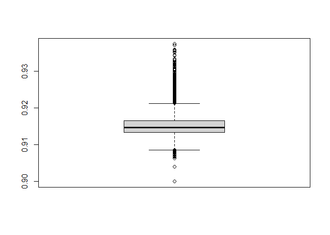
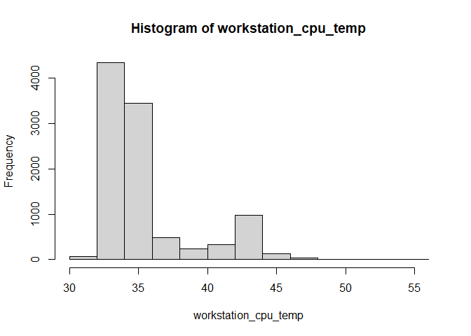

### Descripcion del Dataset 

El archivo junio2022_minuto_sin_interpolación.csv y el archivo
junio2022_minuto_con_interpolación.csv contienen datos medidos
clasificados en :

*Variables Energéticas:* <br> - **Voltaje**<br> - **Corriente**<br> -
**Potencia**<br> - **Frecuencia**<br> - **Energía**<br> - **Factor de
Potencia (fp)**<br> - **Temperatura (esp32_temp)**<br>

*Variables de Rendimiento:* <br> - **CPU (workstation_cpu)**<br> -
**Potencia CPU (workstation_cpu_power)**<br> - **Temperatura CPU
(workstation_cpu_temp)**<br> - **GPU**<br> - **Potencia GPU**<br> -
**Temperatura GPU**<br> - **RAM (workstation_ram)**<br> - **Potencia de
RAM (workstation_ram_power)**<br>

### Datos sin interpolacion

``` r
datos_sin_interpolacion <- read.csv("junio2022_minuto_sin_interpolacion.csv")
head(datos_sin_interpolacion)
```

    ##                 mac weekday         fecha_esp32  voltaje corriente potencia
    ## 1 3C:61:05:12:96:30       3 2022-06-01 00:01:00 119.4133  1.141783 124.9933
    ## 2 3C:61:05:12:96:30       3 2022-06-01 00:02:00 119.4100  1.080950 117.0683
    ## 3 3C:61:05:12:96:30       3 2022-06-01 00:03:00 119.4000  1.082900 117.4250
    ## 4 3C:61:05:12:96:30       3 2022-06-01 00:04:00 119.4067  1.068617 115.4533
    ## 5 3C:61:05:12:96:30       3 2022-06-01 00:05:00 119.4233  1.070567 115.7667
    ## 6 3C:61:05:12:96:30       3 2022-06-01 00:06:00 119.3967  1.185650 130.1133
    ##   frecuencia energia        fp esp32_temp workstation_cpu workstation_cpu_power
    ## 1   59.92833   0.000 0.9158333   49.75923        14.33467              41.89000
    ## 2   59.98833   0.002 0.9071667   49.79627        11.76633              41.19183
    ## 3   60.00000   0.002 0.9073333   51.54627        11.34200              41.89000
    ## 4   59.99833   0.001 0.9043333   49.78701        11.22467              41.89000
    ## 5   59.95500   0.002 0.9055000   50.65738        11.42617              41.89000
    ## 6   59.97833   0.003 0.9181667   48.02775        16.55817              41.89000
    ##   workstation_cpu_temp workstation_gpu workstation_gpu_power
    ## 1             34.53333      0.01666667              35.00000
    ## 2             30.76667      0.00000000              34.41667
    ## 3             30.51667      0.00000000              35.00000
    ## 4             30.00000      0.00000000              35.00000
    ## 5             30.10000      0.00000000              35.00000
    ## 6             39.25000      0.00000000              35.00000
    ##   workstation_gpu_temp workstation_ram workstation_ram_power
    ## 1             14.54300        48.33317              8.626667
    ## 2             14.28000        47.18517              6.558000
    ## 3             14.54233        48.13800              6.598000
    ## 4             14.54950        47.94800              6.428833
    ## 5             14.56000        47.94333              6.423167
    ## 6             14.52117        47.90600             11.830833

``` r
summary(datos_sin_interpolacion)
```

    ##      mac               weekday      fecha_esp32           voltaje     
    ##  Length:43200       Min.   :1.000   Length:43200       Min.   :119.3  
    ##  Class :character   1st Qu.:2.000   Class :character   1st Qu.:119.5  
    ##  Mode  :character   Median :4.000   Mode  :character   Median :119.5  
    ##                     Mean   :3.967                      Mean   :119.5  
    ##                     3rd Qu.:6.000                      3rd Qu.:119.5  
    ##                     Max.   :7.000                      Max.   :119.8  
    ##                                                        NA's   :98     
    ##    corriente         potencia        frecuencia       energia        
    ##  Min.   :0.0958   Min.   :  1.25   Min.   :59.84   Min.   :0.000000  
    ##  1st Qu.:1.0550   1st Qu.:113.94   1st Qu.:59.95   1st Qu.:0.002000  
    ##  Median :1.0780   Median :116.81   Median :59.97   Median :0.002000  
    ##  Mean   :1.0818   Mean   :117.49   Mean   :59.96   Mean   :0.001959  
    ##  3rd Qu.:1.0909   3rd Qu.:118.44   3rd Qu.:59.98   3rd Qu.:0.002000  
    ##  Max.   :1.6260   Max.   :182.79   Max.   :60.07   Max.   :0.003087  
    ##  NA's   :98       NA's   :98       NA's   :98                        
    ##        fp           esp32_temp    workstation_cpu  workstation_cpu_power
    ##  Min.   :0.1017   Min.   :26.11   Min.   : 0.000   Min.   : 0.00        
    ##  1st Qu.:0.9038   1st Qu.:49.38   1st Qu.: 7.616   1st Qu.:40.89        
    ##  Median :0.9068   Median :50.65   Median :10.657   Median :41.55        
    ##  Mean   :0.9084   Mean   :49.67   Mean   :10.688   Mean   :41.05        
    ##  3rd Qu.:0.9097   3rd Qu.:51.53   3rd Qu.:12.672   3rd Qu.:42.92        
    ##  Max.   :0.9705   Max.   :53.33   Max.   :69.023   Max.   :54.87        
    ##  NA's   :98       NA's   :98      NA's   :98       NA's   :98           
    ##  workstation_cpu_temp workstation_gpu    workstation_gpu_power
    ##  Min.   : 0.00        Min.   : 0.00000   Min.   : 0.00        
    ##  1st Qu.:29.12        1st Qu.: 0.00000   1st Qu.:35.00        
    ##  Median :31.03        Median : 0.00000   Median :35.07        
    ##  Mean   :31.48        Mean   : 0.23635   Mean   :34.78        
    ##  3rd Qu.:32.68        3rd Qu.: 0.01667   3rd Qu.:36.00        
    ##  Max.   :77.08        Max.   :33.25000   Max.   :40.13        
    ##  NA's   :98           NA's   :98         NA's   :98           
    ##  workstation_gpu_temp workstation_ram workstation_ram_power
    ##  Min.   : 0.00        Min.   : 0.00   Min.   : 0.000       
    ##  1st Qu.:14.40        1st Qu.:38.25   1st Qu.: 6.456       
    ##  Median :14.53        Median :44.49   Median : 7.443       
    ##  Mean   :14.24        Mean   :43.27   Mean   : 8.115       
    ##  3rd Qu.:14.63        3rd Qu.:49.67   3rd Qu.: 9.430       
    ##  Max.   :39.85        Max.   :62.50   Max.   :23.360       
    ##  NA's   :98           NA's   :98      NA's   :98

### Datos con interpolacion

``` r
datos_con_interpolacion <- read.csv("junio2022_minuto_con_interpolacion.csv")
head(datos_con_interpolacion)
```

    ##                 mac weekday         fecha_esp32  voltaje corriente potencia
    ## 1 3C:61:05:12:96:30       3 2022-06-01 00:01:00 119.4133  1.141783 124.9933
    ## 2 3C:61:05:12:96:30       3 2022-06-01 00:02:00 119.4100  1.080950 117.0683
    ## 3 3C:61:05:12:96:30       3 2022-06-01 00:03:00 119.4000  1.082900 117.4250
    ## 4 3C:61:05:12:96:30       3 2022-06-01 00:04:00 119.4067  1.068617 115.4533
    ## 5 3C:61:05:12:96:30       3 2022-06-01 00:05:00 119.4233  1.070567 115.7667
    ## 6 3C:61:05:12:96:30       3 2022-06-01 00:06:00 119.3967  1.185650 130.1133
    ##   frecuencia energia        fp esp32_temp workstation_cpu workstation_cpu_power
    ## 1   59.92833   0.000 0.9158333   49.75923        14.33467              41.89000
    ## 2   59.98833   0.002 0.9071667   49.79627        11.76633              41.19183
    ## 3   60.00000   0.002 0.9073333   51.54627        11.34200              41.89000
    ## 4   59.99833   0.001 0.9043333   49.78701        11.22467              41.89000
    ## 5   59.95500   0.002 0.9055000   50.65738        11.42617              41.89000
    ## 6   59.97833   0.003 0.9181667   48.02775        16.55817              41.89000
    ##   workstation_cpu_temp workstation_gpu workstation_gpu_power
    ## 1             34.53333      0.01666667              35.00000
    ## 2             30.76667      0.00000000              34.41667
    ## 3             30.51667      0.00000000              35.00000
    ## 4             30.00000      0.00000000              35.00000
    ## 5             30.10000      0.00000000              35.00000
    ## 6             39.25000      0.00000000              35.00000
    ##   workstation_gpu_temp workstation_ram workstation_ram_power
    ## 1             14.54300        48.33317              8.626667
    ## 2             14.28000        47.18517              6.558000
    ## 3             14.54233        48.13800              6.598000
    ## 4             14.54950        47.94800              6.428833
    ## 5             14.56000        47.94333              6.423167
    ## 6             14.52117        47.90600             11.830833

``` r
summary(datos_con_interpolacion)
```

    ##      mac               weekday      fecha_esp32           voltaje     
    ##  Length:43200       Min.   :1.000   Length:43200       Min.   :119.3  
    ##  Class :character   1st Qu.:2.000   Class :character   1st Qu.:119.5  
    ##  Mode  :character   Median :4.000   Mode  :character   Median :119.5  
    ##                     Mean   :3.967                      Mean   :119.5  
    ##                     3rd Qu.:6.000                      3rd Qu.:119.5  
    ##                     Max.   :7.000                      Max.   :119.8  
    ##    corriente         potencia        frecuencia       energia        
    ##  Min.   :0.0958   Min.   :  1.25   Min.   :59.84   Min.   :0.000000  
    ##  1st Qu.:1.0549   1st Qu.:113.92   1st Qu.:59.95   1st Qu.:0.002000  
    ##  Median :1.0780   Median :116.80   Median :59.97   Median :0.002000  
    ##  Mean   :1.0818   Mean   :117.48   Mean   :59.96   Mean   :0.001959  
    ##  3rd Qu.:1.0909   3rd Qu.:118.44   3rd Qu.:59.98   3rd Qu.:0.002000  
    ##  Max.   :1.6260   Max.   :182.79   Max.   :60.07   Max.   :0.003087  
    ##        fp           esp32_temp    workstation_cpu  workstation_cpu_power
    ##  Min.   :0.1017   Min.   :26.11   Min.   : 0.000   Min.   : 0.00        
    ##  1st Qu.:0.9038   1st Qu.:49.37   1st Qu.: 7.616   1st Qu.:40.89        
    ##  Median :0.9068   Median :50.65   Median :10.651   Median :41.56        
    ##  Mean   :0.9084   Mean   :49.65   Mean   :10.687   Mean   :41.05        
    ##  3rd Qu.:0.9097   3rd Qu.:51.53   3rd Qu.:12.670   3rd Qu.:42.92        
    ##  Max.   :0.9705   Max.   :53.33   Max.   :69.023   Max.   :54.87        
    ##  workstation_cpu_temp workstation_gpu    workstation_gpu_power
    ##  Min.   : 0.00        Min.   : 0.00000   Min.   : 0.00        
    ##  1st Qu.:29.10        1st Qu.: 0.00000   1st Qu.:35.00        
    ##  Median :31.02        Median : 0.00000   Median :35.07        
    ##  Mean   :31.48        Mean   : 0.23611   Mean   :34.78        
    ##  3rd Qu.:32.68        3rd Qu.: 0.01667   3rd Qu.:36.00        
    ##  Max.   :77.08        Max.   :33.25000   Max.   :40.13        
    ##  workstation_gpu_temp workstation_ram workstation_ram_power
    ##  Min.   : 0.00        Min.   : 0.00   Min.   : 0.000       
    ##  1st Qu.:14.40        1st Qu.:38.26   1st Qu.: 6.452       
    ##  Median :14.53        Median :44.50   Median : 7.439       
    ##  Mean   :14.24        Mean   :43.28   Mean   : 8.111       
    ##  3rd Qu.:14.63        3rd Qu.:49.66   3rd Qu.: 9.427       
    ##  Max.   :39.85        Max.   :62.50   Max.   :23.360

### Variables Energeticas

### Voltaje

``` r
voltaje <- datos_con_interpolacion[['voltaje']]
```

**Ejemplos**

    ## [1] 119.4133 119.4100 119.4000 119.4067 119.4233 119.3967

**Métricas de Voltaje**

    ## Media:  119.5054

    ## Mediana:  119.5033

    ## Desviación Estándar:  0.03832439


### Corriente

``` r
corriente <- datos_con_interpolacion[['corriente']]
```

**Ejemplos**

    ## [1] 1.141783 1.080950 1.082900 1.068617 1.070567 1.185650

**Métricas de corriente**

    ## Media:  1.081759

    ## Mediana:  1.078017

    ## Desviación Estándar:  0.07263775


### Potencia

``` r
potencia <- datos_con_interpolacion[['potencia']]
```

**Ejemplos**

    ## [1] 124.9933 117.0683 117.4250 115.4533 115.7667 130.1133

**Métricas de potencia**

    ## Media:  117.4814

    ## Mediana:  116.8017

    ## Desviación Estándar:  8.242344


### Frecuencia

``` r
frecuencia <- datos_con_interpolacion[['frecuencia']]
```

**Ejemplos**

    ## [1] 59.92833 59.98833 60.00000 59.99833 59.95500 59.97833

**Métricas de frecuencia**

    ## Media:  59.96451

    ## Mediana:  59.96667

    ## Desviación Estándar:  0.02228845


### Energia

``` r
energia <- datos_con_interpolacion[['energia']]
```

**Ejemplos**

    ## [1] 0.000 0.002 0.002 0.001 0.002 0.003

    ## Métricas de energia:

    ## Media:  0.001958704

    ## Mediana:  0.002

    ## Desviación Estándar:  0.0003432561


\### Factor de Potencia

``` r
fp <- datos_con_interpolacion[['fp']]
```

**Ejemplos**

    ## [1] 0.9158333 0.9071667 0.9073333 0.9043333 0.9055000 0.9181667

**Métricas de fp**

    ## Media:  0.90845

    ## Mediana:  0.9067925

    ## Desviación Estándar:  0.0151849


\### Temperatura ESP32 (Sensor)

``` r
esp32_temp <- datos_con_interpolacion[['esp32_temp']]
```

**Ejemplos**

    ## [1] 49.75923 49.79627 51.54627 49.78701 50.65738 48.02775

**Métricas de esp32_temp**

    ## Media:  49.64942

    ## Mediana:  50.64812

    ## Desviación Estándar:  3.221471


\### Variables de Rendimiento \### Workstation CPU

``` r
workstation_cpu <- datos_con_interpolacion[['workstation_cpu']]
```

**Ejemplos**

    ## [1] 14.33467 11.76633 11.34200 11.22467 11.42617 16.55817

**Métricas de workstation_cpu**

    ## Media:  10.68684

    ## Mediana:  10.65092

    ## Desviación Estándar:  3.811164


\### Potencia Workstation CPU

``` r
workstation_cpu_power <- datos_con_interpolacion[['workstation_cpu_power']]
```

**Ejemplos**

    ## [1] 41.89000 41.19183 41.89000 41.89000 41.89000 41.89000

**Métricas de workstation_cpu_power**

    ## Media:  41.04985

    ## Mediana:  41.56

    ## Desviación Estándar:  5.643873


\### Temperatura Workstation CPU

``` r
workstation_cpu_temp <- datos_con_interpolacion[['workstation_cpu_temp']]
```

**Ejemplos**

    ## [1] 34.53333 30.76667 30.51667 30.00000 30.10000 39.25000

**Métricas de workstation_cpu_temp**

    ## Media:  31.47522

    ## Mediana:  31.02326

    ## Desviación Estándar:  5.916378


\### Workstation GPU

``` r
workstation_gpu <- datos_con_interpolacion[['workstation_gpu']]
```

**Ejemplos**

    ## [1] 0.01666667 0.00000000 0.00000000 0.00000000 0.00000000 0.00000000

**Métricas de workstation_gpu**

    ## Media:  0.2361078

    ## Mediana:  0

    ## Desviación Estándar:  1.154715


\### Potencia Workstation GPU

``` r
workstation_gpu_power <- datos_con_interpolacion[['workstation_gpu_power']]
```

**Ejemplos**

    ## [1] 35.00000 34.41667 35.00000 35.00000 35.00000 35.00000

**Métricas de workstation_gpu_power**

    ## Media:  34.7802

    ## Mediana:  35.06667

    ## Desviación Estándar:  4.719184


\### Temperatura Workstation GPU

``` r
workstation_gpu_temp <- datos_con_interpolacion[['workstation_gpu_temp']]
```

**Ejemplos**

    ## [1] 14.54300 14.28000 14.54233 14.54950 14.56000 14.52117

**Métricas de workstation_gpu_temp**

    ## Media:  14.24204

    ## Mediana:  14.5275

    ## Desviación Estándar:  1.959539


\### Workstation RAM

``` r
workstation_ram <- datos_con_interpolacion[['workstation_ram']]
```

**Ejemplos**

    ## [1] 48.33317 47.18517 48.13800 47.94800 47.94333 47.90600

**Métricas de workstation_ram**

    ## Media:  43.27864

    ## Mediana:  44.49967

    ## Desviación Estándar:  10.11205


\### Potencia Workstation RAM

``` r
workstation_ram_power <- datos_con_interpolacion[['workstation_ram_power']]
```

**Ejemplos**

    ## [1]  8.626667  6.558000  6.598000  6.428833  6.423167 11.830833

**Métricas de workstation_ram_power**

    ## Media:  8.110815

    ## Mediana:  7.438917

    ## Desviación Estándar:  2.592748


### Prueba de bondad de ajuste

### Prueba de significancia sobre la Media

*Hipotesis Nula: La media de la serie de tiempo no cambia
significativamente después de aplicar la interpolación.* *Hipotesis
Alternativa: La media de la serie de tiempo cambia significativamente
después de la interpolación.*

### Prueba de significancia sobre la Varianza

*Hipotesis Nula: La varianza de la serie de tiempo no cambia
significativamente después de aplicar la interpolación.* *Hipotesis
Alternativa: La varianza de la serie de tiempo cambia significativamente
después de la interpolación.*

### Regresion

### Mixed Selection

### Matriz de Correlacion

### Regresion Lineal Multiple
